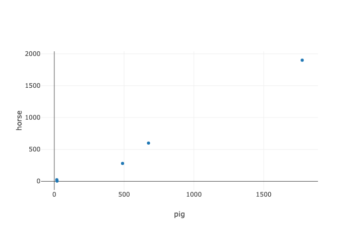

# Scatter Plots

The coordinates of each point are defined by two dataframe columns and filled circles are used to represent each point. Scatter plot is useful for visualizing complex correlations between two variables. 

## Examples

### Scatter Plots on Columns in a DataFrame

In the example below, we use the titanic dataset, to show a close to real world use case of danfo.js

```markup
<!DOCTYPE html>
<html lang="en">

<head>
    <meta charset="UTF-8">
    <meta name="viewport" content="width=device-width, initial-scale=1.0">
     <!--danfojs CDN -->
    <script src="https://cdn.jsdelivr.net/npm/danfojs@0.0.13/dist/index.min.js"></script>
    <title>Document</title>
</head>

<body>

    <div id="plot_div"></div>
    <script>

         dfd.read_csv("https://raw.githubusercontent.com/pandas-dev/pandas/master/doc/data/titanic.csv")
            .then(df => {
            
                df.plot("plot_div", { x: "Age", y: "Fare", type: "scatter", mode: "markers" })

            }).catch(err => {
                console.log(err);
            })

    </script>
</body>

</html>

```

### More Examples

```markup
<!DOCTYPE html>
<html lang="en">

<head>
    <meta charset="UTF-8">
    <meta name="viewport" content="width=device-width, initial-scale=1.0">
     <!--danfojs CDN -->
    <script src="https://cdn.jsdelivr.net/npm/danfojs@0.0.13/dist/index.min.js"></script>
    <title>Document</title>
</head>

<body>

    <div id="plot_div"></div>
    <script>

      df = new dfd.DataFrame({'pig': [20, 18, 489, 675, 1776],
                               'horse': [4, 25, 281, 600, 1900]}, {index: [1990, 1997, 2003, 2009, 2014]})
        df.plot("plot_div", {x: "pig", y: "horse", type: "scatter", mode: "markers"})

    </script>
</body>

</html>

```




For more configuration options for Scatter plots, see the [Plotly](https://plotly.com/javascript/line-and-scatter/) style doc.


